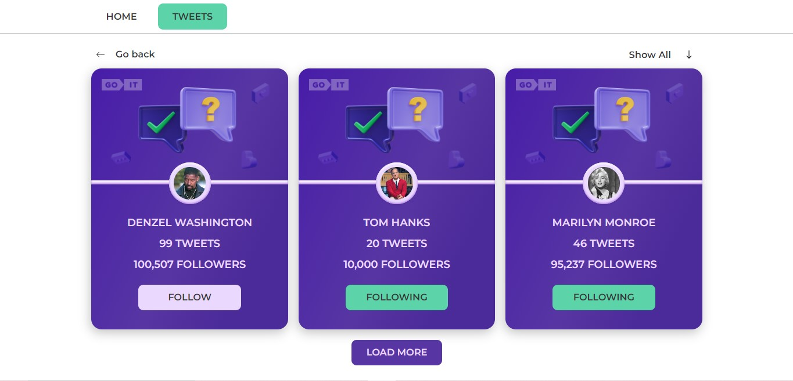

# Test task - Tweets cards

## In this simple app, you'll see tweet cards with interactive buttons

- [Link to site](https://valeriia-nurieva.github.io/test-task-goit/tweets)
- [Link to repository](https://github.com/valeriia-nurieva/test-task-goit)

## Main functionality

- Implemented semantic layout with three breaks (for mobile devices from 380px,
  tablets from 780px, and desktop from 1200px)

- The application has the following routes '/' - the home page; '/tweets' - the
  page displaying tweets. The tweets page has a Back button that leads to the
  main page. If the user enters via a non-existent route, they will be
  redirected to the home page.

- When you click on the Follow button in a user's profile, you are added as a
  follower, and when you click again, you are removed. When the page reloads,
  the entered data is saved.

- The tweets page has a filter: show all - show all tweets follow - show tweets
  that have a follow status. followings - show tweets that have a following
  status

## Used technologies:

The app created using
[Create React App](https://github.com/facebook/create-react-app)

- [Mockapi](https://mockapi.io/) - Backend
- [Styled components](https://styled-components.com/) - For styling
- [Modern normalize](https://www.npmjs.com/package/modern-normalize) - Normalize
  browsers' default style
- [React hot toast](https://react-hot-toast.com/) - Notifications
- [React icons](https://www.npmjs.com/package/react-icons) - For icons
- [React loader spinner](https://www.npmjs.com/package/react-loader-spinner)
- [React scroll to top](https://www.npmjs.com/package/react-scroll-to-top)

## Installation and launch of the project

1. Clone the repository: git clone
   https://github.com/valeriia-nurieva/test-task-goit
2. Make sure you have the LTS version of Node.js installed on your computer.
   Download and install it, if necessary.
3. Install the basic project dependencies with the npm install command.
4. Start development mode by running the npm start command.
5. Go to http://localhost:3000 in your browser. This page will automatically
   reload after saving changes in the project files.

**I'll leave my contacts here and I'd be happy to see your feedback 🙌**

- valerka.0906@gmail.com
- https://t.me/vaaaleeerkaaa
